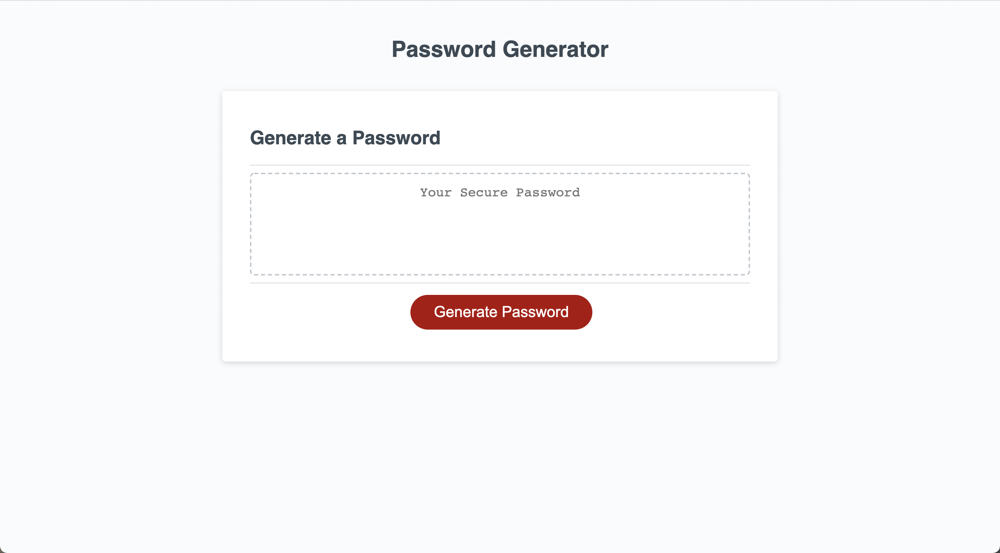

# Online Random Password Generator

## How does it work?

When you land on the page you are prompted with an empty field and a button! When you click the button the program asks you seveal questions. It then prints the password on the page for you to copy :)

## Why do this?

With Cyber-crime on the rise, a simple password can no longer keep you safe. In order to save time and to make sure the your password is secure, the generator takes in your inputs and provides a safe password for you to use.

## Deployment

The portfolio has been deployed at:
[Password Generator](https://punkinut.github.io/password-generator/)

## Main Screenshot

